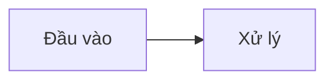

# Scientific Markdown — đặc tả cú pháp

Phương ngữ Markdown SciRender dùng. Mọi thứ không nằm trong tài liệu này thì parser
không hiểu, và khi không hiểu nó **báo lỗi** chứ không đoán (P6).

---

## 1. Front matter

Khối YAML giữa hai dòng `---` ở đầu tệp.

```yaml
---
title: Tiêu đề bài báo
subtitle: Phụ đề tùy chọn
authors:
  - name: Trần Nhật Tường
    affiliation: Khoa Kỹ thuật Y sinh, HCMUT
    email: a@b.edu.vn
    orcid: 0000-0000-0000-0000
    corresponding: true
  - name: Nguyễn Văn A          # dạng rút gọn: - Nguyễn Văn A
date: 2026
language: vi
template: scientific-standard    # ghi đè lựa chọn template ở giao diện
keywords: [huyết áp, PPG, ECG]   # hoặc "a, b, c"
abstract: |
  Nhiều dòng, giữ nguyên xuống dòng.
bibliography:
  - key: smith2020               # bắt buộc — dùng để trích dẫn
    authors: Smith J., Lee K.
    year: 2020
    title: Tiêu đề bài báo
    source: Nature               # hoặc journal / publisher
    volume: "12"
    pages: 101-115
    doi: 10.1000/xyz
    url: https://example.com
---
```

### Khối `cover:` cho mẫu BTL

```yaml
cover:
  university: Đại học Quốc gia TP. Hồ Chí Minh
  school: Trường Đại học Bách khoa
  faculty: Khoa Khoa học Ứng dụng
  reportType: Báo cáo bài tập lớn
  course: Môn Cơ sở Y khoa
  class: L01
  group: Nhóm 1
  advisor: TS. Nguyễn Văn B      # in ra "GVHD: ..."
  place: Tp. HCM
  logo: asset:logo-bk            # logo Bách khoa có sẵn, không cần tải lên
  members:
    - name: Trần Nhật Tường
      mssv: "2210001"
    - name: Nguyễn Văn A
      mssv: "2210002"
```

Dạng rút gọn cũng được: `members: ["Trần Nhật Tường - 2210001"]`.
Mọi khóa đều có tên tiếng Việt thay thế: `truong`, `khoa`, `lop`, `nhom`, `gvhd`,
`thanhvien`, `monhoc`.

### Phần đầu

```yaml
acknowledgement: |
  Nhóm xin trân trọng cảm ơn ...
abbreviations:
  - term: PPG
    meaning: Photoplethysmography — quang thể tích ký
  - term: ECG
    meaning: Electrocardiography — điện tâm đồ
```

Danh mục từ viết tắt chỉ được in khi có từ 3 mục trở lên; danh mục hình và bảng cũng vậy.

Khóa không nằm trong danh sách trên **không bị bỏ đi** — chúng vào `meta.extra` và đi
theo tài liệu (P1).

Nếu không có `title:`, SciRender lấy đề mục cấp 1 đầu tiên làm tiêu đề.

---

## 2. Khối

### Đề mục

```markdown
# Cấp 1
## Cấp 2 {#sec:phuong-phap}
### Cấp 3 {-}          ← {-} = không đánh số
```

### Đoạn văn

Các dòng liền nhau là một đoạn. Một dòng trống mở đoạn mới.
Hai dấu cách cuối dòng tạo ngắt dòng cứng.

### Công thức khối

```markdown
$$
E = mc^2
$$ {#eq:nang-luong}
```

Dạng một dòng cũng được: `$$ a = b $$ {#eq:x}`.

Nhãn có thể đặt ở dòng mở hoặc dòng đóng. `{-}` để không đánh số.
Việc đánh số hay không do template quyết định (`numbering.equations`:
`all` | `labelled` | `none`).

### Hình

```markdown
{#fig:so-do width=80%}
```

Nguồn ảnh chấp nhận:

| Dạng | Ý nghĩa |
|------|---------|
| `asset:ten` | Ảnh trong IndexedDB, tải lên ở tab **Tài nguyên** |
| `https://…` | URL từ xa (cần mạng lúc xem) |
| `data:image/…` | Ảnh nhúng base64 |

Chú thích lấy từ `alt`. Muốn chú thích dài hơn, thêm dòng `: …` ngay dưới:

```markdown


: Chú thích đầy đủ có thể chứa *định dạng* {#fig:x}
```

Thuộc tính hỗ trợ: `width`, `height` (số trần hiểu là px).

Biểu đồ được tạo từ bảng trong Canvas được lưu như một Figure dùng `data:image/svg+xml...`, nên không cần file ảnh ngoài hay thư viện chart bên thứ ba. Nó vẫn đi qua bộ đánh số Hình và cross-reference như mọi `FigureNode` khác.

#### Biểu đồ từ bảng

Từ Canvas, nút **Chuyển bảng thành biểu đồ SVG** mở cấu hình chọn cột X/Y và kiểu `scatter`, `line` hoặc `bar`. Với dữ liệu số, có thể bật hồi quy tuyến tính hoặc bậc 2; phương trình và `R²` được nhúng trực tiếp vào SVG. SVG được lưu như `data:image/svg+xml...`, vì vậy bản PDF vẫn là vector, không phụ thuộc Chart.js/D3/Recharts.

### Bảng

```markdown
| Thuộc tính | Giá trị | Ghi chú |
|:-----------|--------:|:-------:|
| Số đối tượng | 84 | 46 nam |

: Chú thích bảng {#tbl:du-lieu}
```

Dòng phân cách quyết định căn cột: `:---` trái, `---:` phải, `:---:` giữa, `---` mặc định.
Dòng lệch số ô sinh cảnh báo `SR-P020` — bảng vẫn render nhưng lỗi được báo.

### Công thức trong ô bảng

Ô dữ liệu có thể giữ công thức bắt đầu bằng `=`. Công thức không bị thay đổi trong Markdown;
khi render, SciRender tính giá trị để hiển thị. Tọa độ `A1`, `B1`, ... tính trên **các dòng dữ liệu**, không tính dòng tiêu đề.

```markdown
| Khối lượng | Gia tốc | Lực |
|---:|---:|---:|
| 2 | 9.81 | =A1*B1 |
| 3 | 9.81 | =A2*B2 |
|  |  | =SUM(C1:C2) |
```

Hỗ trợ `+`, `-`, `*`, `/`, `^`, ngoặc và `SUM`, `AVERAGE`, `MIN`, `MAX` với dải ô.
Lỗi công thức không bị sửa âm thầm; validator báo mã `SR-T1xx`.

### Căn lề dấu thập phân

Markdown không có cú pháp căn dấu thập phân chuẩn, nên SciRender lưu thuộc tính ở dòng chú thích bảng:

```markdown
: Kết quả đo {#tbl:result decimal-cols=1,3}
```

`decimal-cols` dùng số cột 1-based. Bản in dùng một lưới ba phần để căn thẳng dấu thập phân giữa các dòng.

### Sơ đồ Mermaid

````markdown


: Chú thích sơ đồ {#dia:pipeline dir=TB}
````

Mermaid được render thành SVG **trước khi phân trang**, nên sơ đồ chiếm đúng chiều cao
thật lúc chia trang. Ba việc app tự làm:

- **Co vừa trang.** Sơ đồ được thu theo cả chiều ngang lẫn chiều dọc để lọt vùng nội
  dung, thay vì tràn xuống dưới rồi bị cắt.
- **Tự chọn chiều.** Nếu bạn không ghi `dir=`, app dựng thử cả chiều dọc lẫn chiều ngang
  rồi giữ bản nào vừa trang ở tỉ lệ lớn hơn — sơ đồ nhiều nhánh không còn bị bóp nhỏ.
- **Cảnh báo khi vẫn quá nhỏ.** Thu dưới ngưỡng `diagrams.minScale` thì báo `SR-L003`
  kèm gợi ý tách bớt nhánh.

Ghi `dir=TB` (dọc) hoặc `dir=LR` (ngang) trong dòng chú thích để ép chiều và tắt tự chọn.
Cỡ chữ trong sơ đồ lấy đúng cỡ chữ văn bản, đổi được ở panel Template.

### Khối mã

````markdown
```python
x = 1
```

: Chú thích khối mã {#lst:ten}
````

Nội dung giữ nguyên tuyệt đối, không diễn giải (P1). Khối mã có chú thích sẽ được đánh số
thành **Mã nguồn 3.1** và tham chiếu được bằng `@lst:ten`. Số dòng, tự xuống dòng và cỡ
chữ chỉnh ở panel Template — mẫu BTL đặt 10pt, đúng cỡ tối thiểu mà quy cách cho phép.

**Tô màu cú pháp.** Ghi tên ngôn ngữ ngay sau ba dấu nháy là khối mã được tô màu trong bản
xem trước và bản in. Ngôn ngữ nhận diện được:

`python` `matlab` `c` `cpp` `arduino` `java` `csharp` `javascript` `typescript` `bash`
`sql` `json` `yaml` `xml`/`html` `r` `verilog` `latex` — kèm các tên gọi tắt quen thuộc
(`py`, `js`, `ts`, `c++`, `sh`, `m`, `yml`, `ino`…).

Ngôn ngữ không nằm trong danh sách thì khối mã để nguyên đen trắng — app **không đoán**
ngôn ngữ (P6). Việc tô màu chỉ thêm thẻ bao, không đổi một ký tự nào của mã; nếu phép tô
làm lệch dù một ký tự, kết quả bị bỏ và mã hiện ở dạng thuần (P1).

Bảng màu chọn sao cho khi in trắng đen mỗi loại token ra một mức xám khác nhau. Muốn tắt
hẳn: panel **Template → Khối mã → Tô màu cú pháp**.

### Chú thích chân trang

```markdown
Huyết áp tâm thu[^ht] tỉ lệ nghịch với PTT.

[^ht]: Systolic blood pressure, đo bằng mmHg.
  Dòng thụt lề 2 dấu cách vẫn thuộc chú thích trên.
```

Nhãn đặt tùy ý (`[^1]`, `[^ht]`), **đánh số theo thứ tự được tham chiếu** chứ không theo
thứ tự bạn viết định nghĩa. Định nghĩa đặt ở đâu trong tệp cũng được — nó không nằm trong
dòng văn bản mà được kéo xuống chân **đúng trang có tham chiếu**. Tài liệu hai cột thì
chú thích nằm ở chân cột chứa tham chiếu, đúng thông lệ tạp chí hai cột.

Tham chiếu không có định nghĩa → lỗi `SR-V015`. Định nghĩa không ai dùng → nhắc `SR-V034`.
Tắt toàn bộ chức năng bằng `footnotes.enabled: false` trong template.


### Danh sách

```markdown
- gạch đầu dòng
  - lồng nhau (thụt 2 dấu cách)
- mục hai

1. đánh số
2. mục hai
```

### Trích dẫn khối và khung ghi chú

```markdown
> Trích dẫn khối.

::: note Tiêu đề khung
Nội dung.
:::
```

Biến thể có màu riêng: `note` (mặc định), `tip`, `warning`, `danger`.

### Hàng hai cột

```markdown
::: cols
Khối bên trái.
|||
| A | B |
|---|---|
| 1 | 2 |
:::
```

Dòng ngăn là **đúng ba dấu `|`** trên một dòng riêng — không thể lẫn với dòng bảng.
Mỗi cột chứa khối bất kỳ (đoạn văn, bảng, hình, công thức). Cả hàng là một khối nguyên,
không bị cắt qua trang.

Trên canvas: kéo một card sang **mép trái hoặc mép phải** của card khác là thành hàng hai
cột; nút ⧉ trên đầu card tách ngược lại.

Thiếu dòng `|||` → cảnh báo `SR-P013`. Quên `:::` đóng → lỗi `SR-P012`.

### Đường kẻ ngang

```markdown
---
```

---

## 3. Nội dòng

| Cú pháp | Kết quả |
|---------|---------|
| `**đậm**` | **đậm** |
| `*nghiêng*` hoặc `_nghiêng_` | *nghiêng* |
| `` `mã` `` | `mã` |
| `$a^2+b^2$` | công thức nội dòng (KaTeX) |
| `H~2~O` | chỉ số dưới |
| `E^2^` | chỉ số trên |
| `[chữ](https://…)` | liên kết |
| `@eq:x` `@fig:x` `@tbl:x` `@sec:x` `@dia:x` `@lst:x` | tham chiếu chéo |
| `[@khoa]` `[@a; @b]` | trích dẫn |
| `\*` `\$` `\[` … | thoát ký tự |

Nhãn trong tham chiếu có thể chứa dấu chấm và gạch ngang ở giữa nhưng không kết thúc
bằng chúng — nhờ vậy `@tbl:ketqua.` ở cuối câu vẫn giữ nguyên dấu chấm.

---

## 4. Nhãn và tham chiếu chéo

Nhãn khai báo bằng `{#tien-to:ten}`, tiền tố phải khớp loại đối tượng:

| Tiền tố | Dùng cho |
|---------|----------|
| `sec:` | đề mục |
| `lst:` | khối mã có chú thích |
| `eq:` | công thức |
| `fig:` | hình |
| `tbl:` | bảng |
| `dia:` | sơ đồ |

Sai tiền tố → cảnh báo `SR-V010`. Trùng nhãn → lỗi `SR-V011`.
Tham chiếu tới nhãn không tồn tại → lỗi `SR-V012`, và chỗ đó hiện gạch chân đỏ trên bản
xem trước thay vì biến mất.

Cách hiển thị tham chiếu do template quyết định: `@fig:x` ra "Hình 2.1", `@eq:x` ra "(2.1)".

---

## 5. Đánh số

Do template điều khiển, không do nguồn:

- `numbering.equationStyle` / `figures` / `tables` / `diagrams`: `section` (2.1, 2.2) hoặc
  `continuous` (1, 2, 3).
- `numbering.resetAtDepth`: cấp đề mục nào thì reset bộ đếm theo mục.
- `headings.numberDepth`: đánh số đề mục tới cấp mấy (0 = không đánh số).

Đổi template là đổi toàn bộ cách đánh số mà không phải sửa một ký tự nào trong nguồn.

---

## 6. Trích dẫn và tài liệu tham khảo

Hai kiểu, chọn bằng `citation.style` trong template:

| Kiểu | Trong văn bản | Danh mục cuối |
|---|---|---|
| `numeric` (mặc định BTL) | `[1]`, `[2]` — đánh số **theo thứ tự xuất hiện lần đầu** | theo đúng thứ tự đó, có `[n]` |
| `author-year` | `(Nguyễn, 2020)`, `(Trần và Lê, 2019)`, `(Phạm và cs., 2021)` | xếp theo vần A–Z, thụt treo, không có `[n]` |

Họ lấy là **từ đầu tiên của tác giả thứ nhất** — đúng với tên Việt và với dạng
`Smith J., Lee K.`. Liên từ và cụm "và cs." đổi được bằng `citation.and` / `citation.etAl`.
Thiếu `year` thì hiện `n.d.`.

Mục tham khảo chưa từng được trích dẫn vẫn được liệt kê ở cuối, kèm gợi ý `SR-V032`.
Khóa trích dẫn không có trong `bibliography` là lỗi `SR-V014`.
